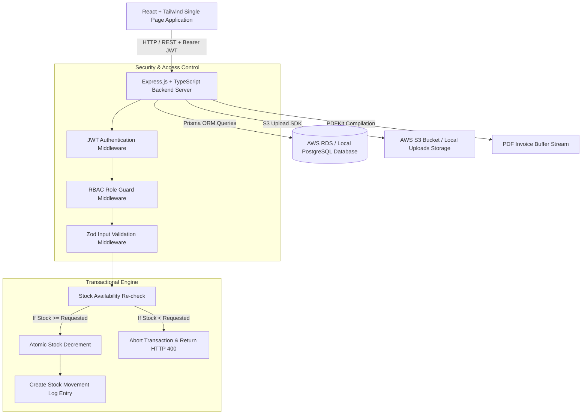
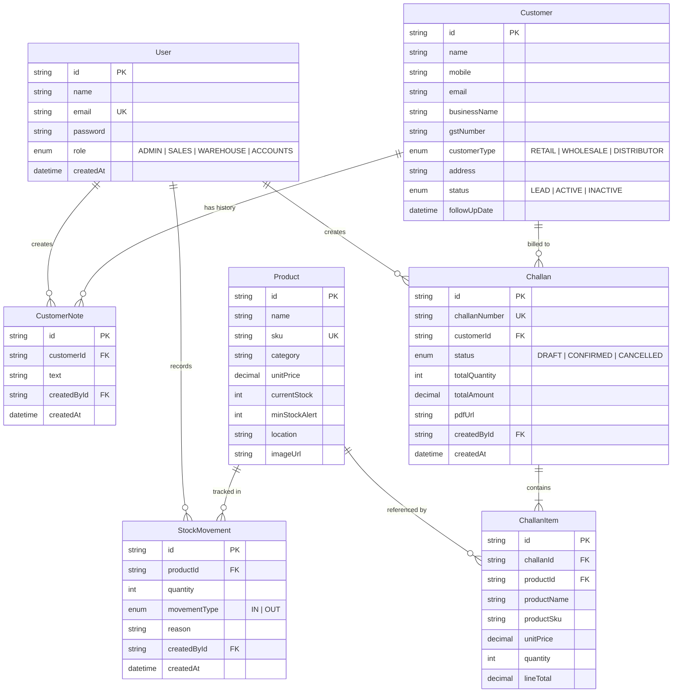

# Technical & Operational Documentation — Mini ERP + CRM Operations Portal

---

## Table of Contents
1. [Executive Summary](#1-executive-summary)
2. [System Architecture & Data Flow](#2-system-architecture--data-flow)
3. [Database Entity-Relationship (ER) Diagram](#3-database-entity-relationship-er-diagram)
4. [Role-Based Access Control (RBAC) Matrix](#4-role-based-access-control-rbac-matrix)
5. [Sales Challan & Transactional Stock Logic](#5-sales-challan--transactional-stock-logic)
6. [API Specification & Endpoints Catalog](#6-api-specification--endpoints-catalog)
7. [PDF Invoice & S3 Image Upload Services](#7-pdf-invoice--s3-image-upload-services)
8. [Local & AWS Infrastructure Guide](#8-local--aws-infrastructure-guide)
9. [Verification & Test Login Credentials](#9-verification--test-login-credentials)

---

## 1. Executive Summary

The **Mini ERP + CRM Operations Portal** is an enterprise-grade full-stack operations management platform built for wholesale and distribution enterprises. The system integrates customer CRM relationship management, inventory catalog tracking with automated low-stock re-order alerts, and a sales challan fulfillment engine enforced by **atomic database transactions**.

### Key Technical Characteristics:
- **Monorepo Layout**: `/backend` (Express, TypeScript, Prisma), `/frontend` (React, TypeScript, Tailwind CSS), `/infra` (Terraform IaC), `/postman`, `/.github/workflows`.
- **Zero-Over-Selling Concurrency Engine**: Challan confirmation (`POST /challans/:id/confirm`) executes inside a single Prisma `$transaction`. If stock is insufficient, the transaction rolls back cleanly without mutating database state.
- **Historical Snapshotting**: Product details (`productName`, `productSku`, `unitPrice`) are snapshotted onto line item rows at point-of-sale to decouple historical invoices from future catalog edits.
- **Dual-Storage Engine**: Dynamically routes product photo uploads to AWS S3 (`@aws-sdk/client-s3`) or local disk storage (`/uploads`) depending on environment key configuration.
- **Dynamic PDF Invoicing**: Automatically compiles formatted A4 sales invoices using `pdfkit`.

---

## 2. System Architecture & Data Flow



---

## 3. Database Entity-Relationship (ER) Diagram



---

## 4. Role-Based Access Control (RBAC) Matrix

Access permissions are enforced on every route via the `authorize(...allowedRoles)` middleware.

| Endpoint | Method | Admin | Sales | Warehouse | Accounts | Purpose |
|---|---|:---:|:---:|:---:|:---:|---|
| `/api/auth/login` | POST | ✅ | ✅ | ✅ | ✅ | User authentication & JWT issuance |
| `/api/auth/me` | GET | ✅ | ✅ | ✅ | ✅ | Current profile payload |
| `/api/dashboard/stats` | GET | ✅ | ✅ | ✅ | ✅ | Operations KPI metrics |
| `/api/customers` | POST | ✅ | ✅ | ❌ | ❌ | Create customer CRM profile |
| `/api/customers` | GET | ✅ | ✅ | ✅ | ✅ | List customers (pagination, search) |
| `/api/customers/:id` | GET | ✅ | ✅ | ✅ | ✅ | View customer & notes timeline |
| `/api/customers/:id` | PUT | ✅ | ✅ | ❌ | ❌ | Edit customer details |
| `/api/customers/:id/notes` | POST | ✅ | ✅ | ❌ | ❌ | Append follow-up note |
| `/api/products` | POST | ✅ | ❌ | ✅ | ❌ | Create product & upload image |
| `/api/products` | GET | ✅ | ✅ | ✅ | ✅ | List catalog & low-stock alerts |
| `/api/products/:id` | PUT | ✅ | ❌ | ✅ | ❌ | Edit product details & image |
| `/api/products/:id/stock-movement` | POST | ✅ | ❌ | ✅ | ❌ | Record manual IN/OUT stock movement |
| `/api/products/:id/stock-log` | GET | ✅ | ✅ | ✅ | ✅ | View stock movement audit log |
| `/api/challans` | POST | ✅ | ✅ | ❌ | ❌ | Create Draft sales challan |
| `/api/challans` | GET | ✅ | ✅ | ✅ | ✅ | List sales challans |
| `/api/challans/:id` | GET | ✅ | ✅ | ✅ | ✅ | View challan snapshot details |
| `/api/challans/:id` | PUT | ✅ | ✅ | ❌ | ❌ | Edit Draft line items |
| `/api/challans/:id/confirm` | POST | ✅ | ✅ | ❌ | ❌ | Confirm challan & deduct stock |
| `/api/challans/:id/cancel` | POST | ✅ | ✅ | ❌ | ❌ | Cancel challan & restore stock |
| `/api/challans/:id/invoice` | GET | ✅ | ✅ | ✅ | ✅ | Download PDF invoice |

---

## 5. Sales Challan & Transactional Stock Logic

The sales challan lifecycle follows a strict state transition machine:

```
[ DRAFT ]  ----(confirm)---->  [ CONFIRMED ]
    |                              |
    +---------(cancel)-------------+---------(cancel)----> [ CANCELLED ]
```

### Confirmation Execution Sequence (`POST /challans/:id/confirm`):
```typescript
const confirmedChallan = await prisma.$transaction(async (tx) => {
  // 1. Re-check stock for every line item inside transaction lock
  for (const item of challan.items) {
    const product = await tx.product.findUnique({ where: { id: item.productId } });
    if (!product || product.currentStock < item.quantity) {
      throw new Error(`INSUFFICIENT_STOCK: '${item.productName}'`);
    }
  }

  // 2. Decrement stock & write StockMovement log (type: OUT)
  for (const item of challan.items) {
    await tx.product.update({
      where: { id: item.productId },
      data: { currentStock: { decrement: item.quantity } },
    });

    await tx.stockMovement.create({
      data: {
        productId: item.productId,
        quantity: item.quantity,
        movementType: 'OUT',
        reason: `Sales Challan ${challan.challanNumber}`,
        createdById: userId,
      },
    });
  }

  // 3. Mark Challan CONFIRMED & attach invoice link
  return await tx.challan.update({
    where: { id },
    data: { status: 'CONFIRMED', pdfUrl: `/api/challans/${id}/invoice` },
  });
});
```

---

## 6. API Specification & Endpoints Catalog

### Standard JSON Response Envelope
```json
{
  "data": { ... },
  "message": "Optional operational success message",
  "total": 100,
  "page": 1,
  "totalPages": 10
}
```

### Standard Error Envelope
```json
{
  "error": {
    "message": "Descriptive error message",
    "field": "Optional field name causing validation error",
    "shortProducts": [ ... ]
  }
}
```

---

## 7. PDF Invoice & S3 Image Upload Services

### Product Image Storage Logic:
1. `multer.memoryStorage()` buffers incoming image files.
2. `s3Service.ts` checks if `AWS_S3_BUCKET`, `AWS_ACCESS_KEY_ID`, and `AWS_SECRET_ACCESS_KEY` are present.
3. If valid, uploads file using `PutObjectCommand` to AWS S3 and returns `https://<bucket>.s3.<region>.amazonaws.com/<key>`.
4. If credentials are empty (local environment), writes file to `backend/uploads/` and returns local URI `/uploads/<filename>`.

### PDF Invoice Engine:
Implemented using `pdfkit` in `backend/src/services/pdfService.ts`. Generates a vector PDF with company banner, customer details, line items table, subtotal/grand totals, and computer-generated footer.

---

## 8. Local & AWS Infrastructure Guide

### Single-Command Local Run:
```bash
docker-compose up --build
```
- Web Portal: `http://localhost:80`
- REST API: `http://localhost:5000/api`

### AWS Infrastructure as Code (Terraform):
```bash
cd infra
terraform init
terraform apply -var="db_password=YourSecurePassword123!" -var="jwt_secret=YourSecret"
```

---

## 9. Verification & Test Login Credentials

Default password for all test accounts: **`Password123!`**

- **System Admin**: `admin@minierp.com`
- **Sales Manager**: `sales@minierp.com`
- **Warehouse Manager**: `warehouse@minierp.com`
- **Accounts Manager**: `accounts@minierp.com`
